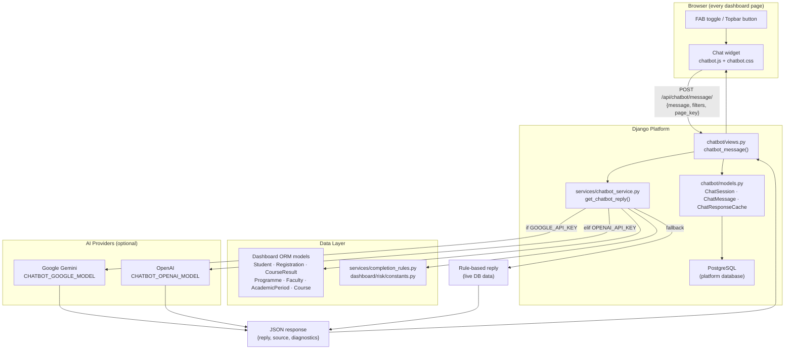
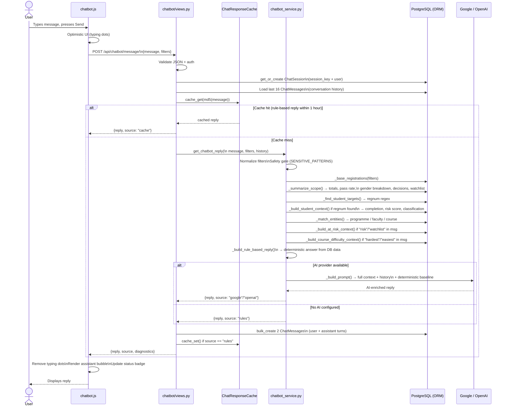
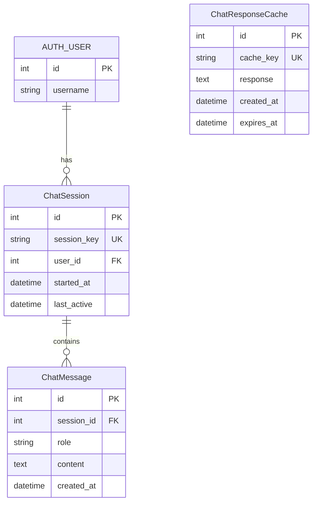
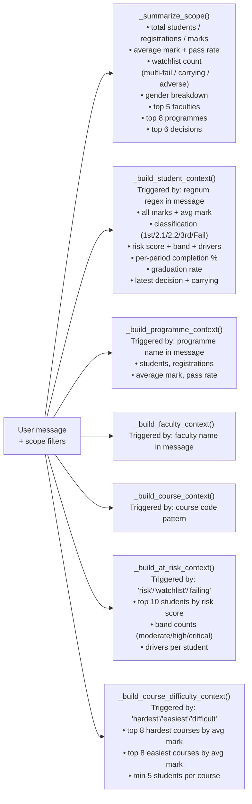
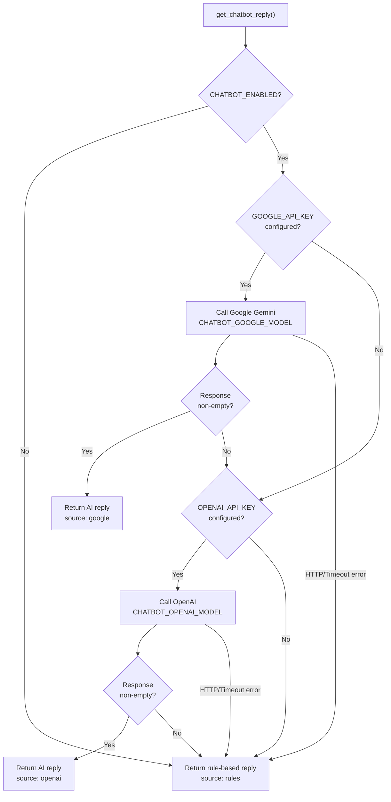

# UniStudio Chatbot — Architecture & Documentation

> **Audience:** Platform developers and management.
> **Last updated:** April 2026

---

## 1. What It Does (Management Summary)

The UniStudio chatbot is a floating assistant embedded on every page of the
registrar platform. Users open it by clicking the chat icon in the top-right of
the toolbar or the floating button at the bottom-right of the screen.

**What users can ask:**

| Category | Example questions |
| --- | --- |
| Student lookup | "What is the status of M22ABC?" |
| At-risk students | "Which students are at risk in this scope?" |
| Programme analytics | "How is the BSc Computer Science performing?" |
| Programme comparison | "Compare ACCT vs BMAN vs INSY pass rates" |
| Course difficulty | "What are the hardest courses this semester?" |
| Completion & graduation | "How is completion percentage calculated?" |
| Decision breakdown | "Show me the academic decisions for this faculty" |
| Demographics | "What is the gender split for this programme?" |
| Admissions | "What are the entry requirements for Engineering?" |
| University info | "Where is MSUAS? What are the contact details?" |
| Student services | "What new programmes are offered in 2026?" |

**Two operating modes:**

- **AI mode** — when a Google Gemini or OpenAI API key is configured, the
  chatbot enriches its reply using the live scoped data as grounding context.
- **Guidance mode** — when no AI key is available, the chatbot still answers
  using deterministic rule-based logic computed directly from the database.
  Every analytical question still gets a real answer from live data.

---

## 2. High-Level Architecture



---

## 3. Detailed Request Flow



---

## 4. File & Module Reference

### Django App — `chatbot/`

| File | Purpose |
| --- | --- |
| [chatbot/models.py](../chatbot/models.py) | Three DB models replacing the prototype's SQLite tables |
| [chatbot/views.py](../chatbot/views.py) | Two AJAX endpoints: `chatbot_message` and `chatbot_clear` |
| [chatbot/urls.py](../chatbot/urls.py) | URL routes under namespace `chatbot` |
| [chatbot/admin.py](../chatbot/admin.py) | Admin interface with inline messages and cache purge action |
| [chatbot/migrations/](../chatbot/migrations/) | Django migrations for the three models |

### Service Layer

| File | Purpose |
| --- | --- |
| [services/chatbot_service.py](../services/chatbot_service.py) | All analytics computation, context building, AI routing |
| [services/completion_rules.py](../services/completion_rules.py) | Authoritative completion percentage rules (imported by chatbot) |
| [dashboard/risk/constants.py](../dashboard/risk/constants.py) | `HIGH_RISK_DECISIONS`, `RISK_BAND_DEFINITIONS`, `RISK_DRIVER_LABELS` (imported by chatbot) |

### Frontend

| File | Purpose |
| --- | --- |
| [templates/base.html](../templates/base.html) | Chat panel + FAB + topbar toggle button HTML |
| [dashboard/static/dashboard/css/chatbot.css](../dashboard/static/dashboard/css/chatbot.css) | All `usc-*` component styles |
| [dashboard/static/dashboard/js/chatbot.js](../dashboard/static/dashboard/js/chatbot.js) | Panel open/close, message send, history render, typing indicator |

---

## 5. Database Models



**`ChatSession`** — one row per browser session per user. Linked to
`request.session.session_key`. A new session is created automatically when
the user's first message arrives.

**`ChatMessage`** — one row per turn (user and assistant messages stored
separately). The view loads the last 16 rows as the AI history window.

**`ChatResponseCache`** — MD5-keyed cache for rule-based replies. TTL is
1 hour. Identical questions from different users share the cache. Only
`source == "rules"` replies are cached — AI and per-student replies are not.

---

## 6. Service Layer — Context Building

The service builds a layered context object before calling the AI or the
rule-based fallback.



---

## 7. Rule-Based Reply Dispatch

When the AI is unavailable (or as the deterministic baseline passed to the AI),
`_build_rule_based_reply` dispatches to the first matching branch:

```
1. Safety gate        → blocked if message matches SENSITIVE_PATTERNS
2. Student lookup     → full profile with completion, risk, classification
3. At-risk listing    → top students by risk band + band breakdown
4. Programme compare  → side-by-side ranked by pass rate (2+ programmes)
5. Course difficulty  → hardest / easiest courses ranked by avg mark
6. Completion rules   → textual explanation of the completion formula
7. Graduation rules   → textual explanation of graduation stage logic
8. Admissions         → entry requirements by faculty, postgrad requirements
9. Student services   → campus services, new 2026 programmes, short courses
10. Contact / info    → location, directions, portals, founded year
11. Single programme  → students, avg mark, pass rate
12. Faculty           → students, avg mark, pass rate
13. Single course     → avg mark, pass rate, student count
14. Risk summary      → watchlist count breakdown
15. Decisions         → decision distribution with adverse total
16. Demographics      → gender breakdown
17. Default           → full scope summary
```

---

## 8. AI Provider Routing



Both providers receive the same prompt:
- System instruction (grounding only)
- University facts, admissions summary, student services, completion rules, graduation rules
- Full scoped live data (JSON)
- Conversation history (last 8 turns)
- Deterministic baseline answer
- User question

---

## 9. Computation Alignment

The chatbot service imports directly from the platform's existing service
files — no duplicated logic.

| Chatbot function | Authoritative source |
| --- | --- |
| `student_completion_percentage()` | `services/completion_rules.py` |
| `_risk_score_for_chat()` | Mirrors `risk/services.py assess_student_risk()` exactly |
| `_classify_mark()` + `GRADING_SCALE` | Platform academic rules |
| `_target_period()` + `PROGRAMME_DURATIONS` | Mirrors `graduation_services._target_period_from_programme()` |
| `_graduation_rate()` | Mirrors graduation rate calculation |
| `HIGH_RISK_DECISIONS` | `dashboard/risk/constants.py` (same set) |
| `RISK_BAND_DEFINITIONS`, `RISK_DRIVER_LABELS` | `dashboard/risk/constants.py` (same definitions) |

---

## 10. Configuration Reference

All settings live in `registrar_platform/settings.py`.

| Setting | Default | Description |
| --- | --- | --- |
| `CHATBOT_ENABLED` | `True` | Master switch — set to `False` to hide the widget entirely |
| `CHATBOT_PROVIDER` | `"auto"` | `"auto"` / `"google"` / `"openai"` — `"auto"` tries Google first |
| `GOOGLE_API_KEY` | `""` | Google Gemini API key |
| `CHATBOT_GOOGLE_MODEL` | `"gemini-2.0-flash"` | Gemini model name |
| `OPENAI_API_KEY` | `""` | OpenAI API key |
| `CHATBOT_OPENAI_MODEL` | `"o4-mini"` | OpenAI model name |
| `CHATBOT_TIMEOUT_SECONDS` | `15` | HTTP timeout for AI provider calls |

**Security:** API keys must be stored in environment variables or a `.env`
file — never committed to version control. The settings file reads them via
`os.getenv()`.

---

## 11. Frontend Widget Anatomy

```
<section class="usc" id="usc">          ← fixed position container
  <div class="usc-panel" hidden>         ← chat panel (flex column)
    <div class="usc-header">             ← gradient header (U avatar, status, clear/close)
    <div class="usc-messages">           ← scrollable message thread
    <div class="usc-suggestions">        ← chips (hidden after first message)
    <form class="usc-form">              ← textarea + send button
  </div>
  <button class="usc-fab">              ← floating action button (below panel in DOM)
</section>

<button class="usc-topbar-btn">         ← secondary toggle in topbar brand-actions
```

**State management** — conversation history is stored in `sessionStorage`
(key `usc-history-v2`) for instant re-render when the panel is reopened.
The authoritative history lives in `ChatMessage` rows in the DB; the client
copy is for display only and is cleared when the user clicks "New conversation".

---

## 12. Security

| Control | Implementation |
| --- | --- |
| Authentication | `@ajax_login_required` decorator on both endpoints |
| CSRF | `X-CSRFToken` header sent with every fetch, validated by Django |
| Input length | `maxlength="1200"` on textarea; server truncates to `MAX_MESSAGE_LENGTH` |
| Injection / jailbreak | `SENSITIVE_PATTERNS` regex gate blocks credential, injection, and override attempts before any DB query or AI call |
| API key exposure | Keys read from environment — never embedded in code or templates |
| Data scope | Chatbot queries respect the same topbar filters (year/period/faculty) as the rest of the platform |

---

## 13. How to Extend

**Add a new reply branch:**
1. Add keyword detection in `_build_rule_based_reply` following the existing
   dispatch pattern (early return for specificity).
2. If new DB data is needed, add a `_build_*_context()` function and call it
   conditionally in `_build_scope_context` — only when the message keywords
   warrant the extra query.

**Add a new AI provider:**
1. Add a `_request_<provider>_chatbot_response(prompt)` function.
2. Add a `<provider>_ready` flag in `get_chatbot_provider_status()`.
3. Insert the provider into the routing chain in `get_chatbot_reply()`.

**Change the suggestion chips:**
In `dashboard/views.py`, update the `suggestions` list inside the
`chatbot_bootstrap` context dictionary passed to every page.

**Disable the chatbot on specific pages:**
Pass `chatbot_enabled=False` in the page view's context. The base template
checks `chatbot_bootstrap.enabled` before rendering the widget or loading the JS.

---

## 14. Standalone Prototype (Reference Only)

The original terminal-based chatbot prototype lives in:

- `registrar_platform/unistudio_chatbot.py`
- `registrar_platform/README.txt`

It is **not used in production**. Its data model (SQLite MemoryDB) has been
replaced by the Django ORM models in `chatbot/`. Its computation functions
(`_completion_pct`, `_classify_mark`, `_graduation_rate`, `_risk_score`) have
been ported into `services/chatbot_service.py` and aligned with the
platform's authoritative service files.

The prototype remains useful as a standalone sandbox for testing prompt changes
or AI provider behaviour without needing the full Django stack running.
