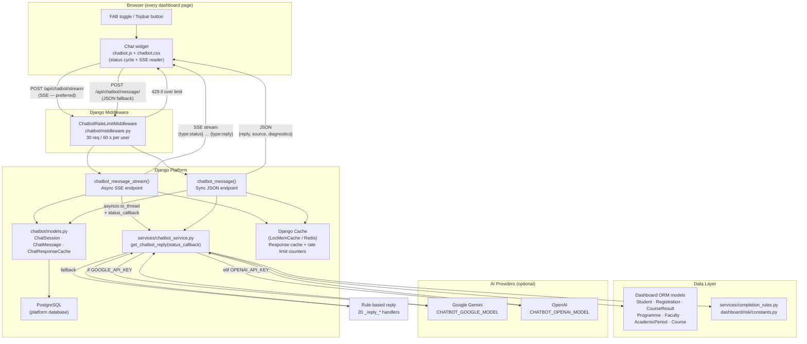
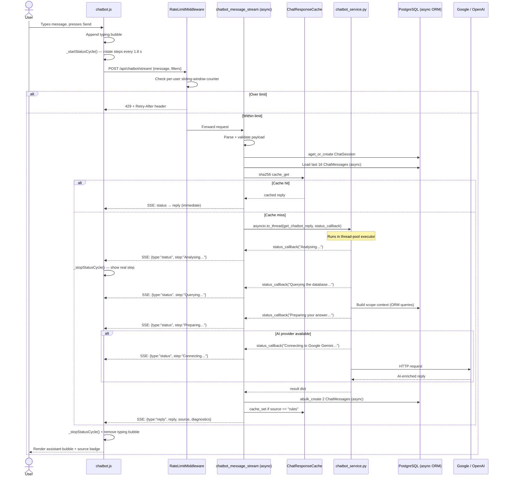
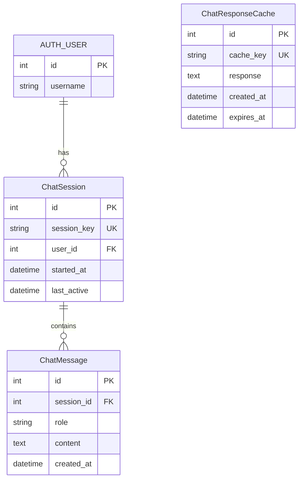
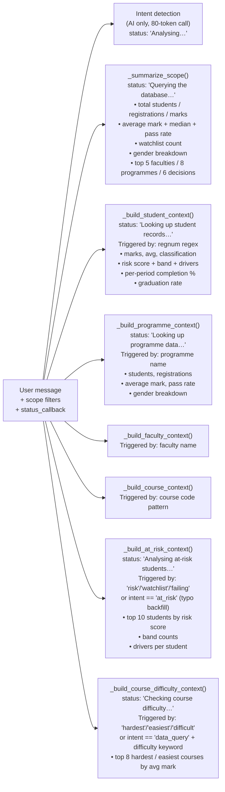
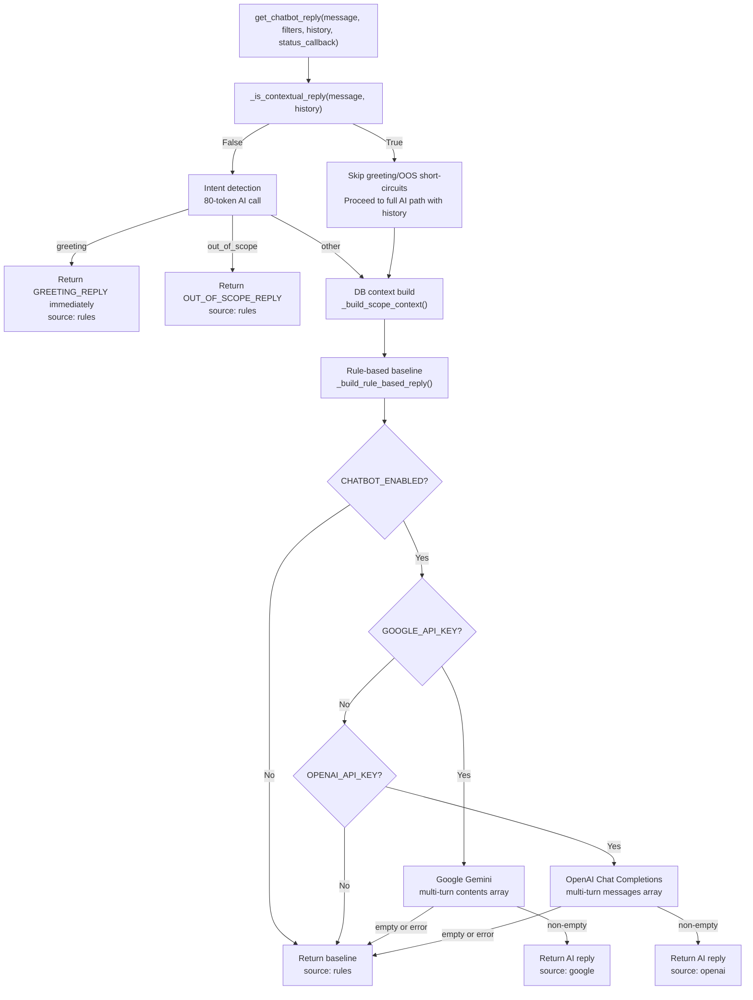

# UniStudio Chatbot — Architecture & Documentation

> **Audience:** Platform developers and management.
> **Last updated:** May 2026

## Changelog

| Date | Change |
| --- | --- |
| May 2026 | Multi-turn conversation memory — contextual follow-up gate, Google Gemini and OpenAI now receive history as genuine API turns instead of flat embedded text |
| May 2026 | Auto-expanding textarea — `.usc-input-wrap` unified input card, fixed `_autoGrow()` cross-browser height algorithm |
| May 2026 | Topbar chatbot toggle button removed — FAB (floating action button) is the sole chat trigger |
| May 2026 | OpenAI provider migrated from Responses API to Chat Completions API for multi-turn support |
| Apr 2026 | Initial release: 20-handler dispatch, async SSE streaming, rate limiting, guidance-mode fallback |

---

## 1. What It Does (Management Summary)

The UniStudio chatbot is a floating assistant embedded on every page of the
registrar platform. Users open it by clicking the chat icon in the top-right of
the toolbar or the floating button at the bottom-right of the screen.

**What users can ask:**

| Category | Example questions |
| --- | --- |
| Student lookup | "What is the status of M22ABC?" |
| At-risk students | "Which students are at risk in this scope?" |
| Programme analytics | "How is the BSc Computer Science performing?" |
| Programme comparison | "Compare ACCT vs BMAN vs INSY pass rates" |
| Course difficulty | "What are the hardest courses this semester?" |
| Completion & graduation | "How is completion percentage calculated?" |
| Decision breakdown | "Show me the academic decisions for this faculty" |
| Demographics | "What is the gender split for this programme?" |
| Admissions | "What are the entry requirements for Engineering?" |
| University info | "Where is MSUAS? What are the contact details?" |
| Student services | "What new programmes are offered in 2026?" |

**Two operating modes:**

- **AI mode** — when a Google Gemini or OpenAI API key is configured, the
  chatbot enriches its reply using the live scoped data as grounding context.
- **Guidance mode** — when no AI key is available, the chatbot still answers
  using deterministic rule-based logic computed directly from the database.
  Every analytical question still gets a real answer from live data.

---

## 2. High-Level Architecture



---

## 3. Request Flow

### 3a. Streaming endpoint (preferred)



### 3b. Plain JSON fallback

Used when `ReadableStream` is unavailable or `stream_endpoint` is not in config.
Identical logic to the streaming path but returns a single JSON object after
the service completes. The client-side status cycle (`_startStatusCycle`) still
runs and is cleared in the `finally` block when the response arrives.

---

## 4. File & Module Reference

### Django App — `chatbot/`

| File | Purpose |
| --- | --- |
| [chatbot/models.py](../chatbot/models.py) | Three DB models: `ChatSession`, `ChatMessage`, `ChatResponseCache` |
| [chatbot/views.py](../chatbot/views.py) | `chatbot_message` (sync JSON), `chatbot_message_stream` (async SSE), `chatbot_clear`; helpers: `_StreamCtx`, `_load_sync_session`, `_load_session`, `_call_service`, `_persist_sync_reply`, `_persist_and_cache`, `_run_service`, `_drain_queue`, `_stream_service_reply` |
| [chatbot/middleware.py](../chatbot/middleware.py) | `ChatbotRateLimitMiddleware` — per-user sliding-window rate limiter |
| [chatbot/urls.py](../chatbot/urls.py) | Three URL routes under namespace `chatbot`: `message`, `stream`, `clear` |
| [chatbot/admin.py](../chatbot/admin.py) | Admin interface with inline messages and cache purge action |
| [chatbot/migrations/](../chatbot/migrations/) | Django migrations for the three models |

### Service Layer

| File | Purpose |
| --- | --- |
| [services/chatbot_service.py](../services/chatbot_service.py) | Analytics computation, context building, AI routing, 20 `_reply_*` handlers |
| [services/completion_rules.py](../services/completion_rules.py) | Authoritative completion percentage rules (imported by chatbot) |
| [dashboard/risk/constants.py](../dashboard/risk/constants.py) | `HIGH_RISK_DECISIONS`, `RISK_BAND_DEFINITIONS`, `RISK_DRIVER_LABELS` |

### Accounts

| File | Purpose |
| --- | --- |
| [accounts/decorators.py](../accounts/decorators.py) | `ajax_login_required` — async-aware; returns the correct coroutine wrapper when decorating an async view |

### Frontend

| File | Purpose |
| --- | --- |
| [templates/base.html](../templates/base.html) | Chat panel + FAB + topbar toggle button HTML |
| [dashboard/static/dashboard/css/chatbot.css](../dashboard/static/dashboard/css/chatbot.css) | All `usc-*` component styles including `.usc-typing-status` |
| [dashboard/static/dashboard/js/chatbot.js](../dashboard/static/dashboard/js/chatbot.js) | Panel open/close, SSE stream reader, status cycle (`_startStatusCycle`, `_stopStatusCycle`), history render |

---

## 5. Database Models



**`ChatSession`** — one row per browser session per user. Linked to
`request.session.session_key`. A new session is created automatically when
the user's first message arrives.

**`ChatMessage`** — one row per turn (user and assistant messages stored
separately). The view loads the last 16 rows as the AI history window.

**`ChatResponseCache`** — SHA-256-keyed cache for rule-based replies. TTL is
1 hour. The cache key includes the message text plus year/period/faculty filters
so users with different active scopes never share stale answers. Only
`source == "rules"` replies are cached — AI and per-student replies are not.

---

## 6. Service Layer — Context Building

The service builds a layered context object before calling the AI or the
rule-based fallback. A `status_callback` is called at each stage so the
streaming view can emit live progress events to the browser.



**Intent-driven backfill** — the AI intent detector is typo-tolerant; keyword
matching is not. After `_build_scope_context` runs, the service checks the
detected intent and triggers any context builder that keyword matching missed
(e.g. `intent == "at_risk"` rebuilds the at-risk context even if the user typed
"ridk" instead of "risk").

---

## 7. Rule-Based Reply Dispatch

`_build_rule_based_reply` is a clean dispatcher that iterates `_REPLY_HANDLERS`
— a tuple of 20 focused handler functions — and returns the first non-`None`
result. Each handler takes `(message_lower, scope, scope_label, context)`
and returns `str | None`.

```text
Handler                     Fires when
─────────────────────────────────────────────────────────────────
_reply_safety_gate          message matches SENSITIVE_PATTERNS
_reply_greeting             hello / hi / thanks (word-boundary)
_reply_out_of_scope         weather / football / crypto etc.
_reply_student_lookup       student_targets populated
_reply_at_risk              at_risk_context populated
_reply_comparison           2+ named programmes matched
_reply_comparison_top_scope compare keyword, no names given
_reply_course_difficulty    course_difficulty populated
_reply_completion_rules     "completion" + explain keyword
_reply_graduation_rules     "graduation" + explain keyword
_reply_admissions           apply / admission / enrol
_reply_student_services     service / accommodation / 2026
_reply_contact              phone / contact / where is / portal
_reply_single_programme     1 programme matched
_reply_faculty              faculty matched
_reply_single_course        course matched
_reply_risk_summary         risk / watchlist keyword (no arc)
_reply_decisions            decision / proceed / retake
_reply_demographics         gender / male / female (per-programme if matched)
_reply_period_performance   month or semester name in message
─────────────────────────────────────────────────────────────────
_reply_default              always (fallback scope summary)
```

Adding a new branch: write one `_reply_<name>` function and append it to
`_REPLY_HANDLERS` before `_reply_default`.

---

## 8. AI Provider Routing

### 8a. Contextual follow-up gate (May 2026)

Before intent detection runs, `get_chatbot_reply` calls `_is_contextual_reply(message, history)` to decide whether the current message is a short follow-up to an ongoing conversation (e.g. "yes", "sure", "go ahead", "which ones?", "tell me more").

**Why this matters:** the intent detector classifies "yes" as `greeting` → the old code immediately returned `GREETING_REPLY` with no context. After the fix, contextual replies bypass the greeting and out-of-scope short-circuits entirely and proceed to the full AI path with complete conversation history.

```python
# _is_contextual_reply logic
if not history or no assistant turn in history:
    return False
if len(message) <= 20:
    return True          # very short + conversation exists → always contextual
if any follow-up token in message words AND len(message) <= 120:
    return True
```

`_FOLLOWUP_TOKENS` covers: `yes, yeah, sure, ok, please, go, ahead, show, tell, more, continue, which, those, them, that, these, how, break, elaborate, explain, details, further, deeper` and others.

### 8b. Routing decision tree



### 8c. Multi-turn prompt structure (May 2026)

History is now sent to the AI as genuine conversation turns — **not** as a flat embedded text block. This is what allows the model to properly continue a thread.

**Google Gemini:**

```python
# _build_google_contents(history, user_turn)
{
  "systemInstruction": {"parts": [{"text": system_text}]},
  "contents": [
    {"role": "user",  "parts": [{"text": "<prior user message>"}]},
    {"role": "model", "parts": [{"text": "<prior assistant reply>"}]},
    ...                          # last MAX_HISTORY_MESSAGES turns
    {"role": "user",  "parts": [{"text": "User question: <current message>"}]}
  ]
}
```

**OpenAI Chat Completions:**

```python
# _build_openai_messages(system_text, history, user_turn)
[
  {"role": "system",    "content": system_text},
  {"role": "user",      "content": "<prior user message>"},
  {"role": "assistant", "content": "<prior assistant reply>"},
  ...                             # last MAX_HISTORY_MESSAGES turns
  {"role": "user",      "content": "User question: <current message>"}
]
```

> **Note:** OpenAI was migrated from the Responses API (`/v1/responses`) to Chat Completions (`/v1/chat/completions`) to support multi-turn history. `_extract_response_text()` now reads `choices[0].message.content` first, falling back to the Responses API format for backward compatibility.

**`_build_system_text(context, fallback_reply)`** — the system-level content passed to both providers. Contains:

- PERSONALITY section: first-person, warm, conversational; explicit instruction to honour follow-up commitments when the user says "yes"
- University facts, admissions, student services, completion rules, graduation rules, risk bands
- Full scoped live data (JSON) + programme reference table
- Deterministic baseline answer (labelled as factual foundation to rewrite)

History is excluded from `_build_system_text` — it travels as real API turns instead.

---

## 9. Streaming & Live Status

### Server side

`chatbot_message_stream` is an `async def` view. The service runs via
`asyncio.to_thread` (thread-pool executor) so it never blocks the event loop.
Status events are posted back to the asyncio event loop using
`loop.call_soon_threadsafe` → `asyncio.Queue`.

```text
chatbot_message_stream (async)
│
├─ _load_session()            async — aget_or_create + history load
├─ _cache_get()               sync_to_async wrapper
│
├─ _stream_cached_reply()     immediate 2-event SSE stream
│
└─ _stream_service_reply(request, _StreamCtx)
   └─ async generator _gen()
      ├─ asyncio.create_task(_run_service)   ← service in thread pool
      │   └─ on_status callback → loop.call_soon_threadsafe → asyncio.Queue
      └─ _drain_queue()
          ├─ poll queue every 0.5 s
          ├─ request.is_disconnected() check (ASGI only — skipped under WSGI)
          └─ yield _sse(event) for each status / reply / error
```

Client disconnect is detected via `request.is_disconnected()` (available on
ASGI requests). Under WSGI the check is skipped automatically (`hasattr` guard)
and the stream finishes naturally.

After the `_done` event the view calls `_persist_and_cache()` which uses the
async ORM (`abulk_create`, `asave`) — no sync DB calls in the async path.

### Client side

The browser always shows live step text in the typing bubble, regardless of
whether ASGI streaming is active:

```text
_startStatusCycle()
  └─ setInterval 1800 ms — rotates TYPING_STEPS array:
       "Analysing your question…"
       "Querying the database…"
       "Looking up relevant data…"
       "Preparing your answer…"

On first real SSE status event:
  _stopStatusCycle()          ← hand off to server-reported step
  _updateTypingStatus(step)   ← show exact server step

In finally (always):
  _stopStatusCycle()          ← prevent timer leak on error / JSON fallback
```

Under WSGI, all SSE events arrive at once when the service completes. The cycle
keeps the typing bubble informative during the wait; the real steps appear
momentarily before the reply renders.

### Running with true streaming (ASGI)

```bash
uvicorn registrar_platform.asgi:application --reload
```

This gives real incremental status updates as the service processes each stage.

---

## 10. Rate Limiting

`chatbot/middleware.py` — `ChatbotRateLimitMiddleware` — guards both chatbot
POST endpoints (`/api/chatbot/message/` and `/api/chatbot/stream/`).

**Algorithm:** sliding window. Each authenticated user gets a list of request
timestamps stored in the Django cache. On every request, timestamps older than
the window are pruned, then the count is checked against the limit.

**Response on limit exceeded:**

```http
HTTP/1.1 429 Too Many Requests
Retry-After: 42
Content-Type: application/json

{"error": "You're sending messages too quickly. Please wait 42 seconds before trying again.", "retry_after": 42}
```

**Cache backend note:** `LocMemCache` (the default) keeps counters in-process
memory. For multi-worker deployments (`uvicorn --workers N`), switch to a
shared cache (Redis) so all workers share the same counters.

---

## 11. Computation Alignment

The chatbot service imports directly from the platform's existing service
files — no duplicated logic.

| Chatbot function | Authoritative source |
| --- | --- |
| `student_completion_percentage()` | `services/completion_rules.py` |
| `_risk_score_for_chat()` | Mirrors `risk/services.py assess_student_risk()` exactly |
| `_classify_mark()` + `GRADING_SCALE` | Platform academic rules |
| `_target_period()` + `PROGRAMME_DURATIONS` | Mirrors `graduation_services._target_period_from_programme()` |
| `_graduation_rate()` | Mirrors graduation rate calculation |
| `HIGH_RISK_DECISIONS` | `dashboard/risk/constants.py` (same set) |
| `RISK_BAND_DEFINITIONS`, `RISK_DRIVER_LABELS` | `dashboard/risk/constants.py` (same definitions) |

---

## 12. Configuration Reference

All settings live in `registrar_platform/settings.py`.

### Chatbot behaviour

| Setting | Default | Description |
| --- | --- | --- |
| `CHATBOT_ENABLED` | `True` | Master switch — set to `False` to hide the widget entirely |
| `CHATBOT_PROVIDER` | `"auto"` | `"auto"` / `"google"` / `"openai"` — `"auto"` tries Google first |
| `GOOGLE_API_KEY` | `""` | Google Gemini API key (env var) |
| `CHATBOT_GOOGLE_MODEL` | `"gemini-2.0-flash"` | Gemini model name |
| `OPENAI_API_KEY` | `""` | OpenAI API key (env var) |
| `CHATBOT_OPENAI_MODEL` | `"o4-mini"` | OpenAI model name |
| `CHATBOT_TIMEOUT_SECONDS` | `15` | HTTP timeout for AI provider calls |

### Rate limiting

| Setting | Default | Description |
| --- | --- | --- |
| `CHATBOT_RATE_LIMIT_REQUESTS` | `30` | Max requests per window per user |
| `CHATBOT_RATE_LIMIT_WINDOW_SECONDS` | `60` | Sliding window size in seconds |

Both settings can be overridden via environment variables of the same name.

### Cache

```python
# settings.py
CACHES = {
    "default": {
        "BACKEND": "django.core.cache.backends.locmem.LocMemCache",
        "LOCATION": "unistudio-main",
    }
}
```

For multi-worker production, switch to:

```python
"BACKEND": "django.core.cache.backends.redis.RedisCache",
"LOCATION": os.getenv("REDIS_URL", "redis://127.0.0.1:6379/1"),
```

**Security:** API keys must be stored in environment variables or a `.env`
file — never committed to version control. The settings file reads them via
`os.getenv()`.

---

## 13. Frontend Widget Anatomy

### 13a. DOM structure

```text
<section class="usc" id="usc">          ← fixed position container (bottom-right)
  <div class="usc-panel" hidden>         ← chat panel (flex column)
    <div class="usc-header">             ← gradient header: U avatar, name, status, clear/close
    <div class="usc-messages">           ← scrollable message thread
    <div class="usc-suggestions">        ← suggestion chips (hidden after first message)
    <form class="usc-form">
      <div class="usc-input-wrap">       ← unified input card (border + focus ring live here)
        <textarea class="usc-input">     ← auto-expanding textarea (rows="1", no border)
        <button class="usc-send">        ← send button (align-self: flex-end, pinned to bottom)
      </div>
    </form>
  </div>
  <button class="usc-fab">              ← sole chat trigger (floating action button)
</section>
```

> **Topbar button removed (May 2026):** The `<button class="usc-topbar-btn" id="usc-topbar-toggle">` that previously appeared in the topbar `brand-actions` area has been removed. The FAB is now the only way to open the chat panel. The `topbarBtn` reference in `chatbot.js` is preserved as a `null`-safe optional (`topbarBtn?.addEventListener`) so no JS changes were needed.

### 13b. Auto-expanding textarea (May 2026)

The textarea grows from one line to a maximum of ~6 lines as the user types, then scrolls internally.

**CSS** — `.usc-input` has no border, background, or fixed height. The border and focus ring live on `.usc-input-wrap` so they surround the whole input card (textarea + send button together). `overflow-y: hidden` by default; JS switches it to `auto` when capped.

**JS** — `_autoGrow()` in `chatbot.js`:

```javascript
const MAX_INPUT_H = 144; // px ≈ 6 lines
function _autoGrow() {
    input.style.height = "0";                          // shrink first — forces correct scrollHeight
    const natural = input.scrollHeight;
    const capped  = Math.min(natural, MAX_INPUT_H);
    input.style.height = capped + "px";
    input.style.overflowY = natural > MAX_INPUT_H ? "auto" : "hidden";
}
```

`_autoGrow` is called on:

- `input` event (every keystroke)
- suggestion chip click (pre-fills input)
- after message sent (reset to `2.5rem` single-line height)

> **Why `height = "0"` instead of `height = "auto"`?** Setting `auto` does not always force a fresh `scrollHeight` calculation in all browsers, especially when `min-height` CSS is present. Setting `"0"` collapses the element first, making `scrollHeight` report only the content height with no influence from prior CSS constraints.

### 13c. Typing bubble

```html
<div class="usc-msg usc-msg--assistant" id="usc-typing">
  <div class="usc-msg-bubble usc-typing">
    <span class="usc-typing-dots">
      <span class="usc-typing-dot"></span>
      <span class="usc-typing-dot"></span>
      <span class="usc-typing-dot"></span>
    </span>
    <span class="usc-typing-status" aria-live="polite">
      Querying the database…             ← live step text (hidden when empty)
    </span>
  </div>
</div>
```

### 13d. State management

Conversation history is stored in `sessionStorage` (key `usc-history-v2`) for instant re-render when the panel is reopened. The authoritative history lives in `ChatMessage` rows in the DB and is loaded server-side on each request (last 16 turns). The client copy is for display only and is cleared when the user clicks "New conversation".

---

## 14. Security

| Control | Implementation |
| --- | --- |
| Authentication | `@ajax_login_required` — async-aware; returns a coroutine wrapper for async views and a sync wrapper for sync views |
| CSRF | `X-CSRFToken` header sent with every fetch, validated by Django |
| Rate limiting | `ChatbotRateLimitMiddleware` — 30 req/60 s per authenticated user; 429 + `Retry-After` header |
| Input length | `maxlength="1200"` on textarea; server truncates to `MAX_MESSAGE_LENGTH` |
| Injection / jailbreak | `SENSITIVE_PATTERNS` regex gate blocks credential, injection, and override attempts before any DB query or AI call |
| API key exposure | Keys read from environment — never embedded in code or templates |
| Cache key integrity | SHA-256 hash of `message + year + period + faculty` — scope-scoped so cross-filter cache hits are impossible |
| Data scope | Chatbot queries respect the same topbar filters (year/period/faculty) as the rest of the platform |

---

## 15. How to Extend

**Add a new reply branch:**

1. Write a `_reply_<name>(message_lower, scope, scope_label, context) -> str | None` function.
2. Return `None` if the handler should not fire; return the reply string when it does.
3. Insert it into `_REPLY_HANDLERS` in `chatbot_service.py` at the appropriate priority position (before `_reply_default`).
4. If new DB data is needed, add a `_build_*_context()` function and call it conditionally in `_build_scope_context`.

**Add a new status step:**
Call `status_callback("Your step label…")` at the relevant point inside
`get_chatbot_reply`. The SSE stream and client-side cycle both pick it up
automatically.

**Add a new AI provider:**

1. Add a `_request_<provider>_chatbot_response(system_text, history, user_turn)` function using `_build_openai_messages` or `_build_google_contents` as a reference.
2. Add a `<provider>_ready` flag in `get_chatbot_provider_status()`.
3. Insert the provider into the routing chain in `get_chatbot_reply()`.

**Change the suggestion chips:**
In `dashboard/views.py`, update the `suggestions` list inside the
`chatbot_bootstrap` context dictionary passed to every page.

**Disable the chatbot on specific pages:**
Pass `chatbot_enabled=False` in the page view's context. The base template
checks `chatbot_bootstrap.enabled` before rendering the widget or loading the JS.

**Switch to Redis for production:**
Update `CACHES["default"]` in `settings.py` to `RedisCache` and set
`REDIS_URL` in the environment. No code changes required — both the response
cache and the rate limiter use Django's cache framework.

---

## 16. Standalone Prototype (Reference Only)

The original terminal-based chatbot prototype lives in:

- `registrar_platform/unistudio_chatbot.py`
- `registrar_platform/README.txt`

It is **not used in production**. Its data model (SQLite MemoryDB) has been
replaced by the Django ORM models in `chatbot/`. Its computation functions
have been ported into `services/chatbot_service.py` and aligned with the
platform's authoritative service files.

The prototype remains useful as a standalone sandbox for testing prompt changes
or AI provider behaviour without needing the full Django stack running.
