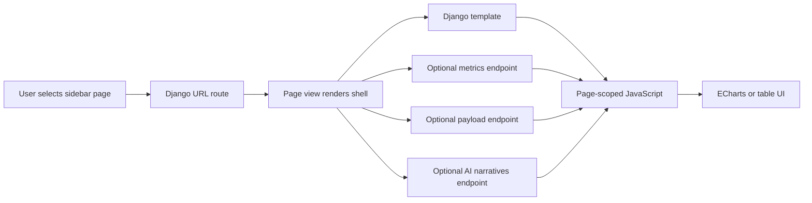
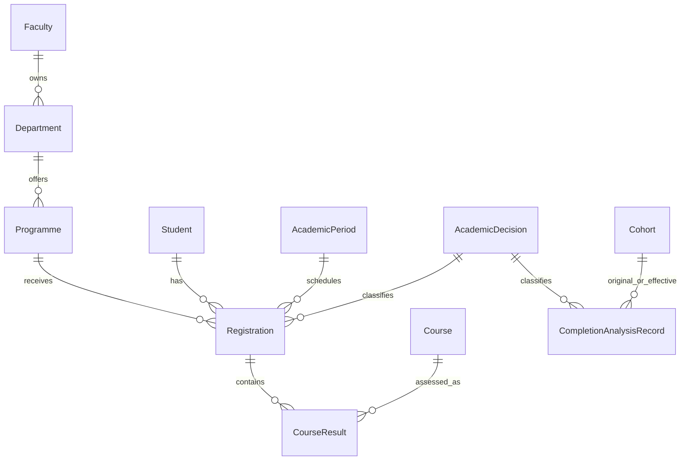

# Sidebar Page Documentation

This folder documents every page shown in the UniStudio sidebar. Each guide is
written for two audiences:

- non-technical users who need to understand what the page is saying
- technical maintainers who need to understand the route, data flow, services,
  templates, JavaScript, and operational checks

## Sidebar Pages

| Sidebar label | Route | Guide |
| --- | --- | --- |
| Dashboard | `/` | [dashboard.md](dashboard.md) |
| Students | `/students/` and `/students/<slug>/` | [students.md](students.md) |
| Programmes | `/programme/` | [programmes.md](programmes.md) |
| Demographics | `/demographic/` | [demographics.md](demographics.md) |
| Academic Levels | `/academic-level/` | [academic-levels.md](academic-levels.md) |
| Completion Analysis | `/completion/` | [completion-analysis.md](completion-analysis.md) |
| Graduation Analysis | `/graduation/` | [graduation-analysis.md](graduation-analysis.md) |
| Risk Analysis | `/risk/` | [risk-analysis.md](risk-analysis.md) |
| Insights | `/insights/` | [insights.md](insights.md) |
| System Management | `/system-management/` | [system-management.md](system-management.md) |

## Shared Platform Pattern

Most pages follow the same platform shape:

## Shared Data Model

## How To Keep These Docs Fresh

- Update the page guide when a sidebar page changes behavior.
- Update route names when `dashboard/urls.py` changes.
- Update the file map when new services, templates, or JavaScript modules are
  introduced.
- Keep non-technical wording focused on what a university operator can do with
  the page.
- Keep technical wording focused on how data is filtered, calculated, cached,
  rendered, and tested.
