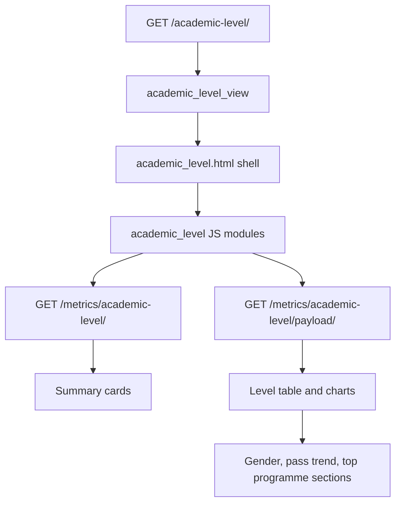

# Academic Levels Page

Route: `/academic-level/`

Sidebar label: `Academic Levels`

Primary audience: academic administrators who need to compare student outcomes
by year and semester.

## What This Page Does

The Academic Levels page compares academic performance and registration pressure
across progression levels such as Year 1 Semester 1, Year 3 Semester 2, and so
on.

For non-technical users, this page answers:

- Which academic levels have the most students?
- Which levels have weaker pass rates?
- Where is performance improving or dropping?
- Which programmes dominate each level?

For technical users, the page uses a feature-owned backend package and
page-scoped JavaScript modules. It hydrates metrics and chart payloads after the
page shell loads.

## Page Architecture

## Main Files

| Layer | Files |
| --- | --- |
| URL routes | `dashboard/urls.py` |
| Views | `dashboard/academic_levels/views.py` |
| Data services | `dashboard/academic_levels/services.py` |
| AI narratives | `dashboard/academic_levels/ai_insights.py` |
| Template | `dashboard/templates/dashboard/academic_level.html` |
| JavaScript | `dashboard/static/dashboard/js/academic_level.js`, `dashboard/static/dashboard/js/academic_level/` |
| Tests | `dashboard/academic_levels/tests.py` |

## Data Inputs

- `Registration.period.academic_year` and `Registration.period.semester`.
- `CourseResult.mark` for average marks and pass rates.
- `Programme` and `Faculty` for filter and grouping context.

## User Experience Notes

- Use human-readable level labels such as `Year 4 Semester 2`.
- Keep table pagination and accordion refresh behavior aligned.
- Empty level rows should explain that no matching academic level data exists.

## Maintenance Checklist

- Keep pagination state independent from chart data state.
- Run `python manage.py test dashboard.academic_levels.tests` after service or
  frontend table changes.
