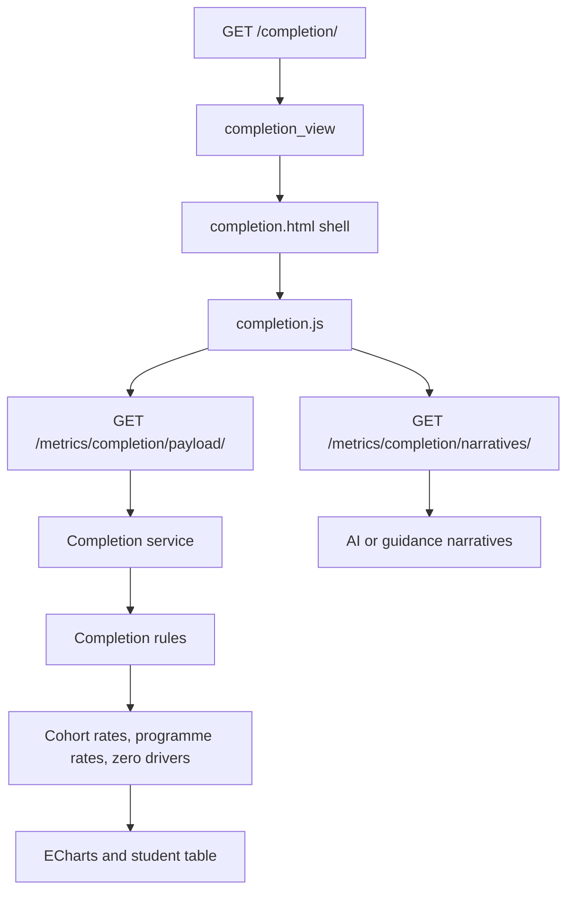
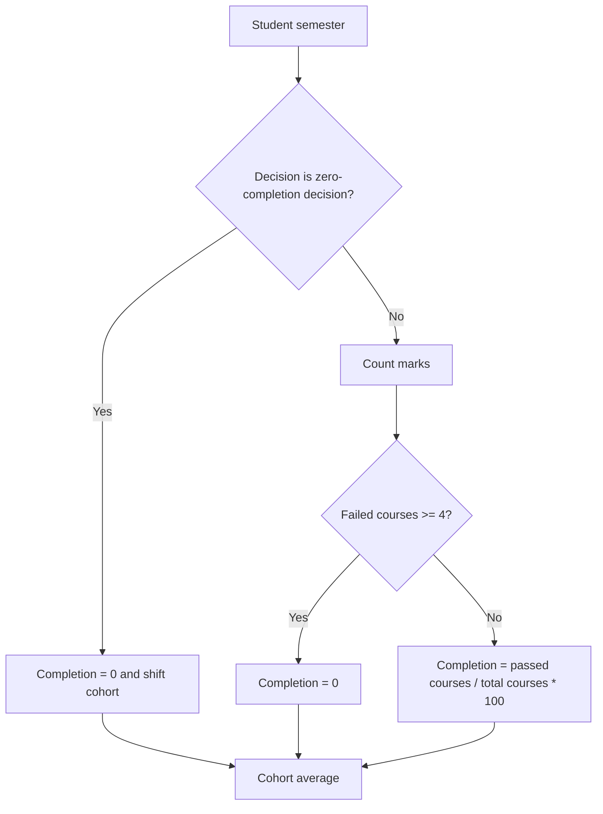

# Completion Analysis Page

Route: `/completion/`

Sidebar label: `Completion Analysis`

Primary audience: registrars and academic leaders monitoring semester
completion, zero-progress cases, and effective cohort movement.

## What This Page Does

The Completion Analysis page measures semester progress using the documented
completion rules. It shows completion rates by visible cohort period,
programme, and zero-completion driver.

For non-technical users, this page answers:

- What is the average completion rate for the visible students?
- Which cohorts are progressing well or poorly?
- Which visible cohort periods now contain students at each progression stage?
- Which programmes have stronger or weaker completion?
- Why are students sitting at zero completion?
- How many students have shifted into later effective cohorts?
- Which students make up the current completion table, 10 at a time?

For technical users, the page is built around shared completion rules in
`services/completion_rules.py` and payload construction in
`services/completion_service.py`.

## Core Business Rules

- Pass mark is `50`.
- Any mark below `50` is a failed course.
- If a student fails `4` or more courses in a semester, completion is `0%`.
- Eight academic decisions force `0%` completion for that semester.
- Most zero-completion decisions shift the next effective cohort by `+1`.
- `Suspended for two semesters` shifts the next effective cohort by `+2`.
- If no zero-completion rule applies, completion is calculated from passed
  courses over total courses.
- Heatmap stages are displayed on a cumulative cohort timeline:
  `Y1 S1`, `Y1 S2`, `Y2 S1`, and so on.
- A later visible cohort period can contain several displayed stages at once.

## Page Architecture

## Rule Flow

## Main Files

| Layer | Files |
| --- | --- |
| URL routes | `dashboard/urls.py` |
| Views | `dashboard/completion/views.py` |
| Business rules | `services/completion_rules.py` |
| Data service | `services/completion_service.py` |
| AI narratives | `dashboard/completion/ai_insights.py` |
| Template | `dashboard/templates/dashboard/completion.html` |
| JavaScript | `dashboard/static/dashboard/js/completion.js` |
| CSS | `dashboard/static/dashboard/css/completion.css` |
| Tests | `dashboard/completion/tests.py` |

## Data Inputs

- `CompletionAnalysisRecord` provides imported completion-analysis rows.
- `Registration` and `CourseResult` support rule-based recalculation.
- `Cohort`, `AcademicDecision`, and `ZeroCompletionReason` provide cohort and
  driver classification.

## Cohort Timeline Note

The completion heatmap does not simply trust the raw `academic_year` and
`semester` imported on every registration row.

Instead, it maps each visible registration to a displayed progression stage
based on how far that registration is from the student's first visible intake
period in the ordered cohort timeline.

That means a manually validated cohort progression such as:

- first visible period -> `Y1 S1`
- next visible period -> `Y1 S2`
- third visible period -> `Y2 S1`

is preserved even when the raw imported stage fields are noisy or offset.

## User Experience Notes

- Zero-completion driver charts use axis-aligned bars because there are too many
  categories for a pie chart.
- Programme labels should be shortened in charts but preserved in tooltips.
- Chart footers should show the AI pill only when AI generated the narrative;
  otherwise they should show guidance.
- The `Completion Rate Details` table is paginated at `10` students per page.
- The completion table header is sticky so column labels remain visible while
  scrolling.

## Maintenance Checklist

- Keep rule constants in `completion_rules.py` as the source of truth.
- Keep completion and graduation services aligned on effective cohort handling.
- Run `python manage.py test dashboard.completion.tests` after rule changes.
