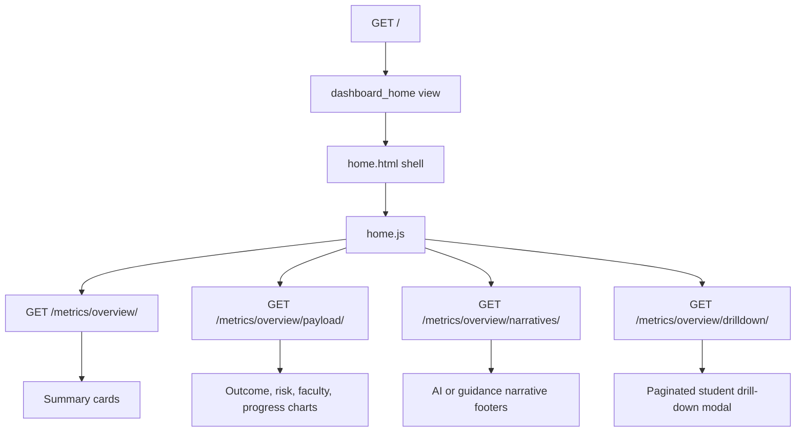

# Dashboard Page

Route: `/`

Sidebar label: `Dashboard`

Primary audience: executives, registrars, academic administrators, and platform
operators who need a fast overview before opening specialist pages.

## What This Page Does

The Dashboard is the landing page for the platform. It summarizes the current
academic picture using top-level metrics, charts, quick insight cards, and
click-through drill-downs.

For non-technical users, this page answers:

- How many students are visible in the current filter scope?
- How healthy is the current academic cohort?
- Which faculties, programmes, or progression groups need attention?
- Which specialist page should I open next?

For technical users, this page is an asynchronous shell. The first request
renders the layout quickly, then separate JSON endpoints hydrate metrics, chart
payloads, drill-down data, and optional AI narratives.

## Page Architecture

## Main Files

| Layer | Files |
| --- | --- |
| URL routes | `dashboard/urls.py` |
| Views | `dashboard/overview/views.py` |
| Data services | `dashboard/overview/services.py` |
| AI narratives | `dashboard/overview/ai_insights.py` |
| Template | `dashboard/templates/dashboard/home.html` |
| CSS | `dashboard/static/dashboard/css/home.css` and shared `base.css` |
| JavaScript | `dashboard/static/dashboard/js/home.js`, `dashboard/static/dashboard/js/home/` |
| Tests | `dashboard/overview/tests.py`, shared `dashboard/tests.py` |

## Data Inputs

- `Registration` records provide the visible student population.
- `CourseResult` records provide pass, fail, mark, and outcome signals.
- `Programme`, `Department`, and `Faculty` records support grouping.
- Risk profiles are reused from the risk service where needed.

## User Experience Notes

- The global filters at the top of the page control the visible scope.
- Clicking chart bars or slices opens a drill-down list of matching students.
- Narrative badges show whether copy is AI-generated or deterministic guidance.
- Empty states should explain what filter or data condition caused the empty
  result.

## Maintenance Checklist

- Keep endpoint names in sync with `dashboard/urls.py`.
- Keep chart drill-down keys aligned between frontend modules and
  `build_overview_drilldown_data()`.
- Run `python manage.py check` after route or template changes.
- Run `python manage.py test dashboard.overview.tests` after overview logic
  changes.
