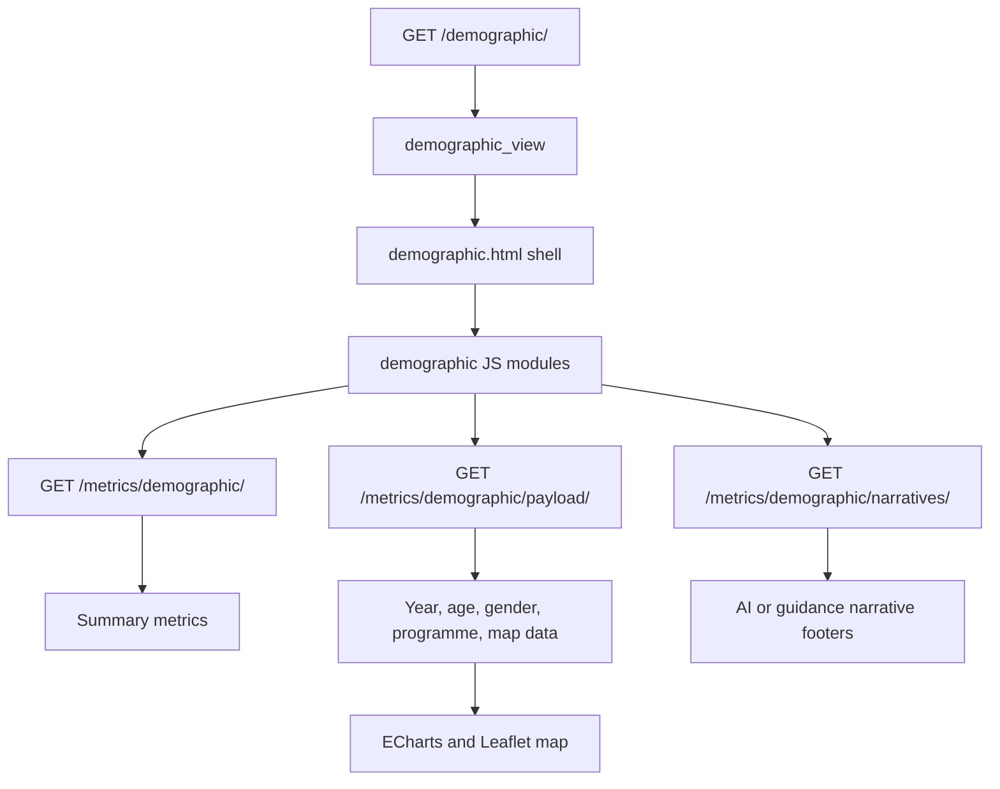

# Demographics Page

Route: `/demographic/`

Sidebar label: `Demographics`

Primary audience: administrators who need to understand learner distribution by
gender, age, origin, academic year, and programme.

## What This Page Does

The Demographics page explains who the current student population is. It groups
students by attributes such as gender, age, place of birth, academic year, and
programme concentration.

For non-technical users, this page answers:

- What does the current learner population look like?
- Are gender or age groups balanced across academic years?
- Where are students coming from geographically?
- Which demographic patterns may need planning attention?

For technical users, the demographics feature owns its backend services, AI
narratives, ECharts sections, and Leaflet origin map.

The year-distribution chart now follows the same cumulative cohort-timeline
logic as the Completion Analysis heatmap:

- the active topbar cohort period is resolved first
- each visible registration is mapped to its intake-relative progression stage
- the chart then collapses semester stages into parent years

Example:

- `Y1 S1` and `Y1 S2` both roll up under `Year 1`
- `Y2 S1` and `Y2 S2` both roll up under `Year 2`

## Page Architecture

## Main Files

| Layer | Files |
| --- | --- |
| URL routes | `dashboard/urls.py` |
| Views | `dashboard/demographics/views.py` |
| Data services | `dashboard/demographics/services.py` |
| AI narratives | `dashboard/demographics/ai_insights.py` |
| Template | `dashboard/templates/dashboard/demographic.html` |
| JavaScript | `dashboard/static/dashboard/js/demographic.js`, `dashboard/static/dashboard/js/demographic/` |
| Tests | `dashboard/demographics/tests.py` |

## Data Inputs

- `Student.gender`, `Student.date_of_birth`, `Student.age`, and
  `Student.place_of_birth`.
- `Registration` and `AcademicPeriod` for year and period filtering.
- `Programme`, `Department`, and `Faculty` for grouping.

## User Experience Notes

- Age should be calculated from date of birth when source age is unavailable.
- Map coordinates must be validated before rendering markers.
- Empty map states should explain that no location data matched the current
  filters.
- When a topbar cohort period is selected, the year-distribution bars should
  match the completion heatmap after collapsing semester stages into years.

## Maintenance Checklist

- Keep location normalization and map fallbacks conservative.
- Keep `build_registration_pk_to_progression_year_map()` aligned with the
  shared completion progression mapping.
- Run `python manage.py test dashboard.demographics.tests` after data-shaping or
  narrative changes.
