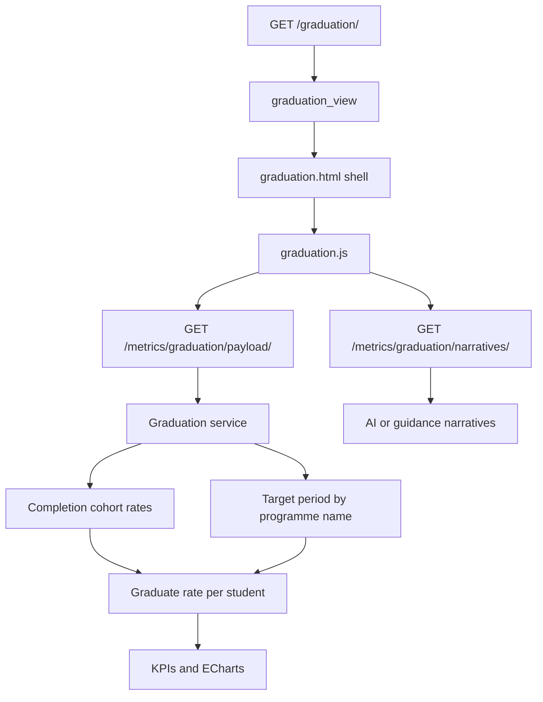
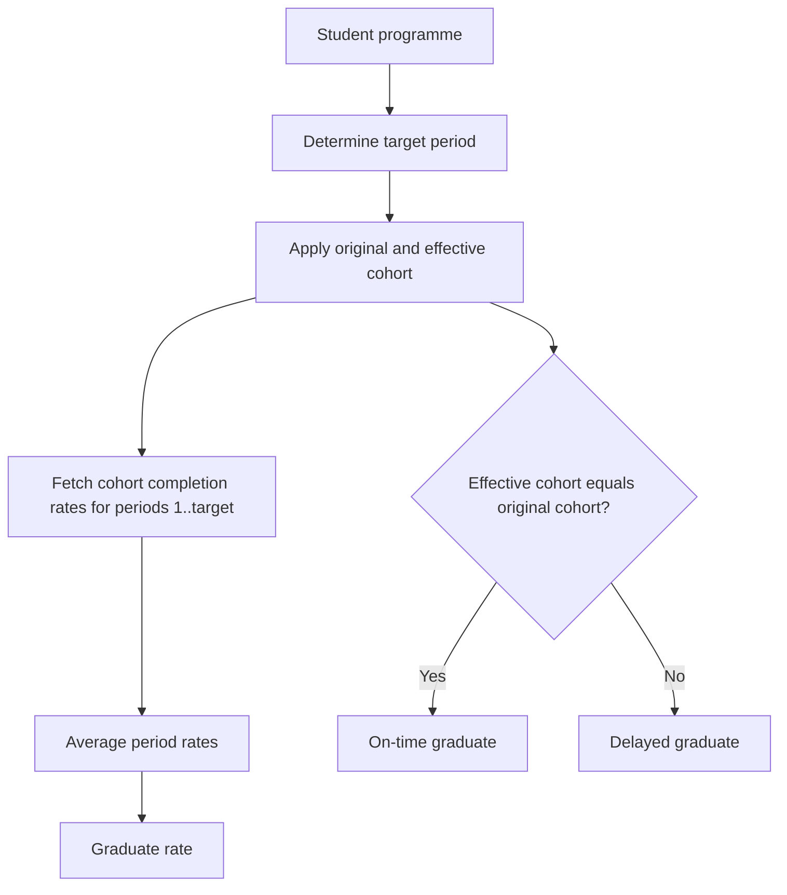

# Graduation Analysis Page

Route: `/graduation/`

Sidebar label: `Graduation Analysis`

Primary audience: registrars and academic leaders monitoring graduation,
on-time completion, and cohort conversion.

## What This Page Does

The Graduation Analysis page measures graduation using documented programme
stage rules and effective cohorts. It reports total graduates, average
graduation rate, on-time graduation, cohort conversion, faculty rates, and
programme graduation rates.

For non-technical users, this page answers:

- How many students reached their expected graduation point?
- Which cohorts converted into graduates?
- How many graduates finished on time?
- Which faculties or programmes are performing better?
- Are graduation rates low because students have not reached the target period
  yet, or because outcomes are weak?

For technical users, graduation reuses completion logic. A graduate's rate is
not recalculated from only the student's own marks. It is the average of cohort
completion rates across the target programme period.

## Core Business Rules

- Programme names containing `masters` graduate at Year 2 Semester 2, period 4.
- Programme names containing `engineering` graduate at Year 5 Semester 2, period
  10.
- All other programmes graduate at Year 4 Semester 2, period 8.
- Effective cohort includes all decision shifts.
- On-time graduation means `effective_cohort == original_cohort`.
- Cohort graduation rate is `graduated / enrolled * 100`.
- Average graduation rate is the average graduate rate across visible graduates.

## Page Architecture

## Graduation Calculation

## Main Files

| Layer | Files |
| --- | --- |
| URL routes | `dashboard/urls.py` |
| Views | `dashboard/graduation/views.py` |
| Business rules | `services/completion_rules.py` |
| Completion support | `services/completion_service.py` |
| Graduation service | `services/graduation_services.py` |
| AI narratives | `dashboard/graduation/ai_insights.py` |
| Template | `dashboard/templates/dashboard/graduation.html` |
| JavaScript | `dashboard/static/dashboard/js/graduation.js` |
| CSS | `dashboard/static/dashboard/css/graduation.css` |
| Tests | `dashboard/graduation/tests.py` |

## Data Inputs

- `CompletionAnalysisRecord` provides original/effective cohorts and completion
  stages.
- `Programme.name` determines the target graduation period.
- `Registration` and `CourseResult` support fallback or derived analysis.
- `Faculty` and `Programme` provide grouped graduation rates.

## User Experience Notes

- Low graduate counts can mean the dataset has not yet reached the target
  period for many programmes.
- KPIs should clearly distinguish graduate count, average graduate rate, and
  cohort conversion.
- Charts should not imply failure where the cohort is simply not mature enough.

## Maintenance Checklist

- Keep target period rules in sync with the written academic policy.
- Keep completion and graduation cohort definitions aligned.
- Run `python manage.py test dashboard.graduation.tests` after graduation logic
  changes.
