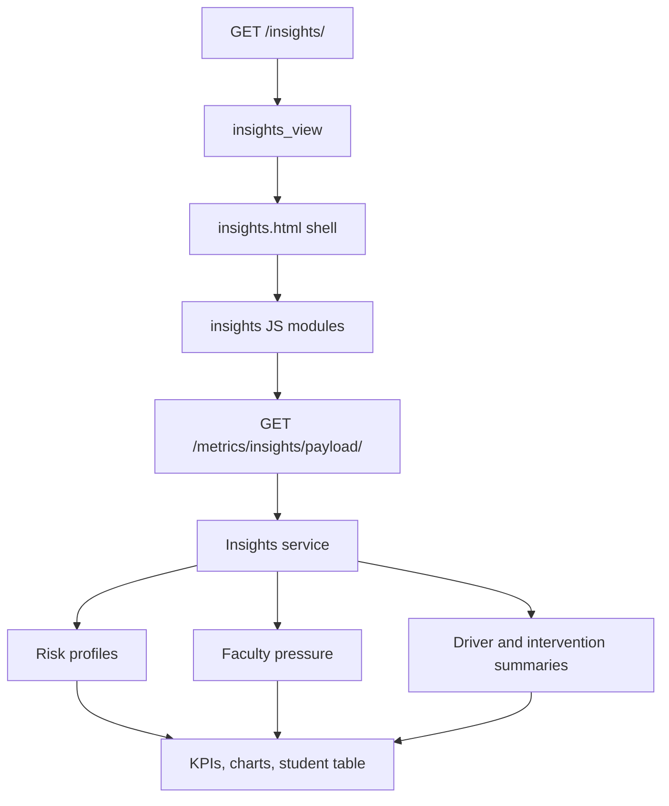

# Insights Page

Route: `/insights/`

Sidebar label: `Insights`

Primary audience: institutional leaders who need a cross-page watchlist,
recommendations, and operational summary.

## What This Page Does

The Insights page is the platform's monitoring workspace. It combines signals
from risk, registration load, retention, faculty concentration, and intervention
needs into an executive summary.

For non-technical users, this page answers:

- How much student support pressure is visible right now?
- Which faculty or trigger is driving the watchlist?
- What action should teams consider next?
- Which students need attention under the current filter?
- How do I move through the full attention queue 10 students at a time?

For technical users, the page is intentionally payload-driven. The initial shell
loads quickly, and `/metrics/insights/payload/` supplies the final cards, chart
rows, recommendation content, and narrative state.

## Page Architecture

## Main Files

| Layer | Files |
| --- | --- |
| URL routes | `dashboard/urls.py` |
| Views | `dashboard/insights/views.py` |
| Data services | `dashboard/insights/services.py` |
| AI narratives | `dashboard/insights/ai_insights.py` |
| Presenters | `dashboard/insights/presenters.py` |
| Template | `dashboard/templates/dashboard/insights.html` |
| JavaScript | `dashboard/static/dashboard/js/insights.js`, `dashboard/static/dashboard/js/insights/` |
| Tests | `dashboard/insights/tests.py` |

## Data Inputs

- Risk profiles from `dashboard/risk/services.py`.
- Registrations filtered by year, period, and faculty.
- Course results and carried-module counts.
- Programme and faculty grouping.

## User Experience Notes

- KPI helper text should update after payload hydration and should not stay in
  loading copy once real data has arrived.
- The primary takeaway should be written as an action-oriented summary.
- The student table should match the same filter scope shown in the topbar.
- `Students Needing Attention` now uses the full flagged-student list from the
  payload instead of a short preview.
- The attention queue is paginated at `10` students per page with page-level
  `Prev` and `Next` controls.
- In `Intervention Summary`, a single failed module and a single carried module
  are treated as the same driver and displayed as `1 carried module`.

## Maintenance Checklist

- Keep presenter placeholder copy and payload hydration copy aligned.
- Run `python manage.py test dashboard.insights.tests` after insight payload or
  narrative changes.
