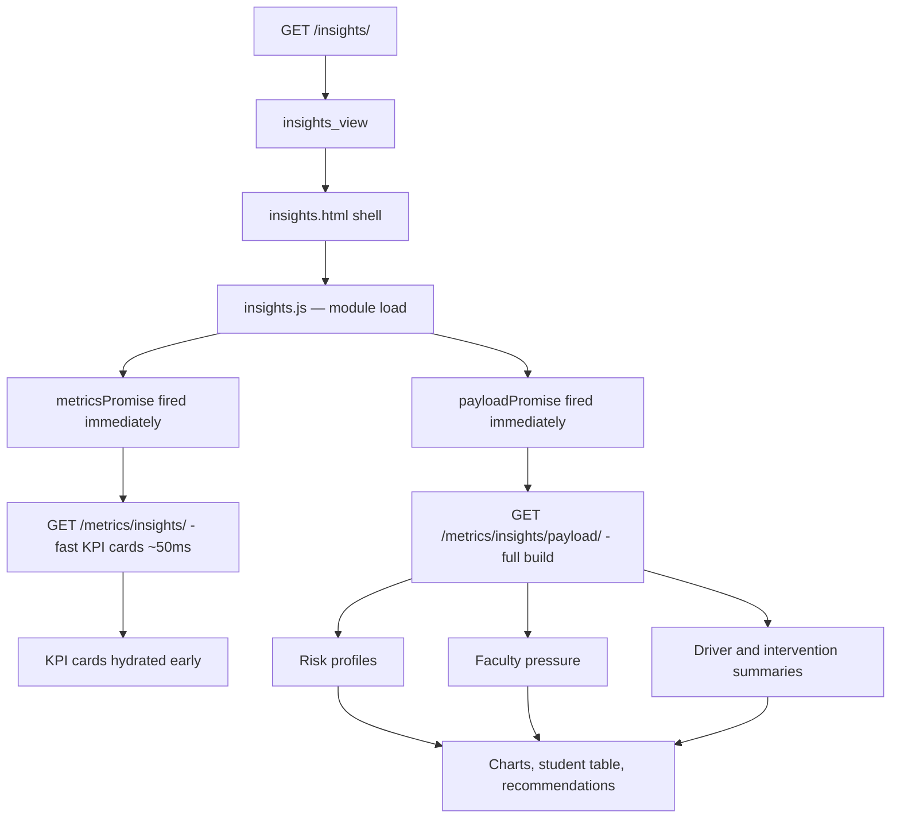

# Insights Page

Route: `/insights/`

Sidebar label: `Insights`

Primary audience: institutional leaders who need a cross-page watchlist,
recommendations, and operational summary.

## What This Page Does

The Insights page is the platform's monitoring workspace. It combines signals
from risk, registration load, retention, faculty concentration, and intervention
needs into an executive summary.

For non-technical users, this page answers:

- How much student support pressure is visible right now?
- Which faculty or trigger is driving the watchlist?
- What action should teams consider next?
- Which students need attention under the current filter?
- How do I move through the full attention queue 10 students at a time?

For technical users, the page uses a two-phase load. The initial shell renders
immediately. `/metrics/insights/` returns KPI card values within ~50ms using DB
aggregates. `/metrics/insights/payload/` then supplies the final chart rows,
student table, recommendation content, and narrative state.

## Page Architecture

## Main Files

| Layer | Files |
| --- | --- |
| URL routes | `dashboard/urls.py` |
| Views | `dashboard/insights/views.py` |
| Data services | `dashboard/insights/services.py` |
| AI narratives | `dashboard/insights/ai_insights.py` |
| Presenters | `dashboard/insights/presenters.py` |
| Template | `dashboard/templates/dashboard/insights.html` |
| JavaScript | `dashboard/static/dashboard/js/insights/index.js`, `dashboard/static/dashboard/js/insights/` |
| Tests | `dashboard/insights/tests.py` |

## Endpoints

| Route | Function | Purpose |
| --- | --- | --- |
| `GET /insights/` | `insights_view` | Render HTML shell |
| `GET /metrics/insights/` | `insights_metrics` | Fast KPI cards via DB aggregates |
| `GET /metrics/insights/payload/` | `insights_payload` | Full chart rows, flagged students, recommendations |
| `GET /metrics/insights/drilldown/` | `insights_drilldown_payload` | Paginated student rows for chart clicks |

## Performance Notes

- `insights.js` fires `metricsPromise` and `payloadPromise` at module load (before `initialiseInsightsPage` runs) so both requests are in-flight from the first network tick.
- `initialiseInsightsPage` accepts both promises as arguments. The metrics promise resolves via a `.then()` side-chain to hydrate KPI cards early; the payload promise is `await`ed for the main render.
- The full payload build calls `build_student_risk_profiles_from_request_and_registrations`, which shares a single `get_filtered_registrations` fetch with the faculty load calculation. Earlier versions fetched registrations twice.
- Cache TTL is 300 seconds. Fast metrics and full payload results are cached under separate keys derived from the active filter scope.
- The fast metrics endpoint uses DB-level `Avg` and `Count` aggregates with simplified risk scoring (marks and fail count only, excluding carried modules and decisions). The numbers are directionally correct for immediate display and are replaced by exact values when the full payload arrives.
- Drilldown profile builds are cached in `_get_cached_insights_profiles` under a key derived from the full request query string (300 s TTL). Both `build_hierarchical_drilldown_data` and `build_insights_drilldown_payload` share this cache, so the first drilldown click within a filter scope builds once and subsequent clicks read from cache.

## Data Inputs

- Risk profiles from `dashboard/risk/services.py`.
- Registrations filtered by year, period, and faculty.
- Course results and carried-module counts.
- Programme and faculty grouping.

## User Experience Notes

- KPI helper text should update after payload hydration and should not stay in
  loading copy once real data has arrived.
- The primary takeaway should be written as an action-oriented summary.
- The student table should match the same filter scope shown in the topbar.
- `Students Needing Attention` now uses the full flagged-student list from the
  payload instead of a short preview.
- The attention queue is paginated at `10` students per page with page-level
  `Prev` and `Next` controls.
- In `Intervention Summary`, a single failed module and a single carried module
  are treated as the same driver and displayed as `1 carried module`.
- The risk distribution note should read: `Values in brackets represent risk bands.`

## Maintenance Checklist

- Keep presenter placeholder copy and payload hydration copy aligned.
- Run `python manage.py test dashboard.insights.tests` after insight payload or
  narrative changes.
