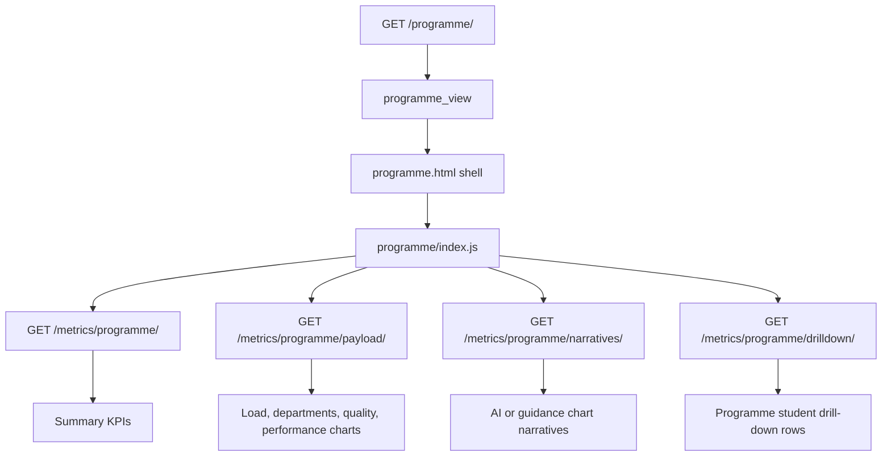

# Programmes Page

Route: `/programme/`

Sidebar label: `Programmes`

Primary audience: faculty leaders, programme coordinators, and administrators
who need to compare programme load, pass rates, departments, and student
concentration.

## What This Page Does

The Programmes page groups student registration and result activity by programme
and department. It highlights where enrolment is concentrated, which programmes
carry heavy academic pressure, and which programme groups need follow-up.

For non-technical users, this page answers:

- Which programmes have the largest enrolment?
- Which programmes are underperforming?
- Which departments carry the heaviest student load?
- Where should academic support or quality review start?

For technical users, this page follows the feature-owned async pattern with a
shell view, metrics endpoint, payload endpoint, narratives endpoint, and
drill-down endpoint.

## Page Architecture

## Main Files

| Layer | Files |
| --- | --- |
| URL routes | `dashboard/urls.py` |
| Views | `dashboard/programmes/views.py` |
| Data services | `dashboard/programmes/services.py` |
| AI narratives | `dashboard/programmes/ai_insights.py` |
| Template | `dashboard/templates/dashboard/programme.html` |
| JavaScript | `dashboard/static/dashboard/js/programme.js`, `dashboard/static/dashboard/js/programme/` |
| Tests | `dashboard/programmes/tests.py` |

## Data Inputs

- `Registration` provides student counts and active programme footprint.
- `Programme`, `Department`, and `Faculty` provide hierarchy.
- `CourseResult` provides pass rate and performance measures.

## User Experience Notes

- Programme names may be shortened in charts to keep labels readable.
- Full programme names should remain available in tooltips or drill-downs.
- Chart clicks should open a student list for the selected programme, department,
  or quality bucket.

## Maintenance Checklist

- Keep chart keys in JavaScript aligned with `build_programme_drilldown_data()`.
- Keep payload rows compact enough for large programme sets.
- Run `python manage.py test dashboard.programmes.tests` after service changes.
