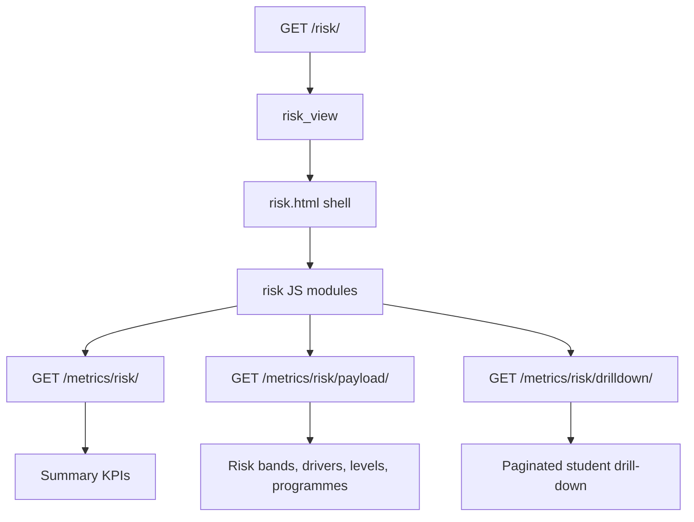

# Risk Analysis Page

Route: `/risk/`

Sidebar label: `Risk Analysis`

Primary audience: advisors, student-support teams, and academic leaders who
need to identify students requiring intervention.

## What This Page Does

The Risk Analysis page classifies students into risk bands using academic
signals such as failed courses, carried modules, average marks, and decisions.
It shows where risk is concentrated and provides drill-downs to the students in
each band or driver group.

For non-technical users, this page answers:

- How many students are low, medium, high, or critical risk?
- Which academic levels or programmes carry the largest watchlist pressure?
- What is driving risk most strongly?
- Which students should be reviewed first?
- Which students are in the `Action Register`, 10 at a time?

For technical users, risk is a feature-owned module with services, presenters,
payload endpoints, ECharts sections, and drill-down routes.

## Page Architecture

## Main Files

| Layer | Files |
| --- | --- |
| URL routes | `dashboard/urls.py` |
| Views | `dashboard/risk/views.py` |
| Data services | `dashboard/risk/services.py` |
| AI narratives | `dashboard/risk/ai_insights.py` |
| Presenters | `dashboard/risk/presenters.py` |
| Template | `dashboard/templates/dashboard/risk.html` |
| Drill-down templates | `risk_band_drilldown.html`, `risk_driver_drilldown.html`, `risk_level_drilldown.html`, `risk_programme_drilldown.html` |
| JavaScript | `dashboard/static/dashboard/js/risk.js`, `dashboard/static/dashboard/js/risk/` |
| Tests | `dashboard/risk/tests.py` |

## Data Inputs

- `CourseResult.mark` for average mark and failed-course counts.
- `Registration.carrying` for carried-module pressure.
- `Registration.decision` for progression or administrative decisions.
- `Programme`, `Faculty`, and academic level labels for grouping.

## User Experience Notes

- Risk bands are a support prioritization tool, not a disciplinary label.
- Drill-down pages should keep row data focused and operational.
- The page should make the main risk driver easy to see before the user opens a
  student list.
- The page-level `Action Register` is paginated at `10` students per page.
- `Prev` and `Next` on the `Action Register` should preserve the current filter
  scope while moving through the register.

## Maintenance Checklist

- Keep risk thresholds documented in `dashboard/risk/services.py` and tests.
- Keep drill-down route parameters aligned with chart keys.
- Run `python manage.py test dashboard.risk.tests` after risk calculation
  changes.
