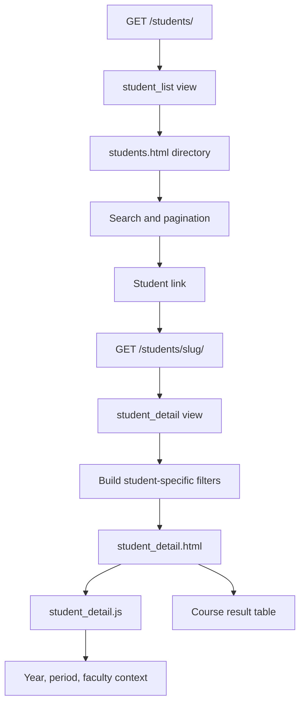
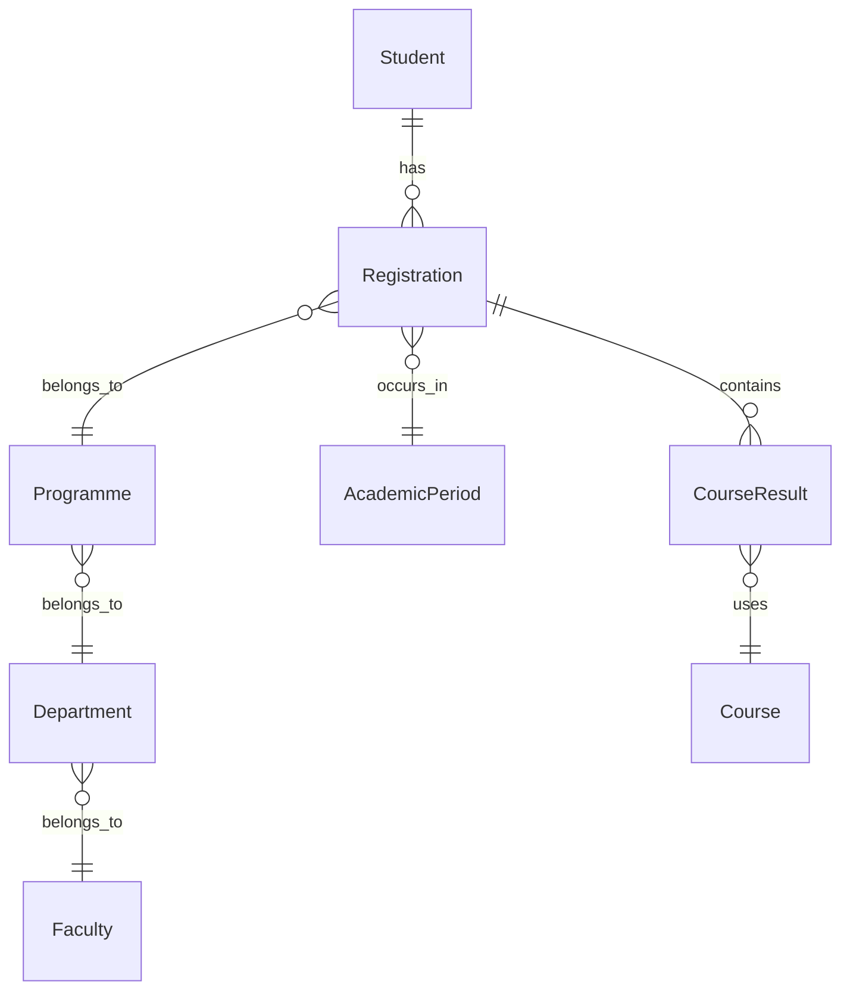

# Students Page

Routes: `/students/` and `/students/<slug>/`

Sidebar label: `Students`

Primary audience: administrators and advisors who need to find a learner and
review the learner's academic record in context.

## What This Page Does

The Students page provides a searchable directory and a student detail view. The
directory shows the latest useful record per learner. The detail page shows
programme, current term context, cumulative grade, decisions, and course-level
results.

For non-technical users, this page answers:

- Who is this student?
- Which programme and faculty is the student attached to?
- Which academic year and period am I looking at?
- What courses and marks are recorded for that period?
- Are there decisions or missing results that affect interpretation?

For technical users, the student detail page now uses student-scoped global
filters. The year, period, and faculty dropdowns are restricted to records that
actually exist for the selected student, and empty result years are omitted to
avoid confusing users.

The student detail page also distinguishes clearly between ordinary semesters
and repeated-history semesters:

- ordinary semesters show one period label in the dropdown and a flat modules table
- repeated semesters can show merged period history in the dropdown
- repeated semesters can split the modules table into separate period sections,
  latest attempt first

The detail page also rebases messy imported academic stages into a contiguous
student-facing progression. That rebasing now happens after chronological
grouping, so later module blocks are not incorrectly hidden inside earlier
displayed years simply because the import reused the same raw year/semester.

## Page Architecture



## Data Relationships



## Main Files

| Layer | Files |
| --- | --- |
| URL routes | `dashboard/urls.py` |
| Views | `dashboard/views.py` |
| Templates | `dashboard/templates/dashboard/students.html`, `student_detail.html` |
| CSS | `dashboard/static/dashboard/css/students.css`, shared `base.css` |
| JavaScript | `dashboard/static/dashboard/js/student_detail.js`, shared `filters.js` |
| Tests | `dashboard/tests.py` |

## Filter Rules

- Faculty options are limited to the student's real faculties.
- If the student has records in only one faculty, the faculty filter is locked.
- Year options are academic progression labels, not just calendar years.
- Years or periods with no course results are hidden from the result tabs.
- Selecting a global year or period updates the table below to the matching
  student record.

## Student Detail Display Rules

- Cumulative grade is shown as a whole number on the profile card.
- The dropdown semester label should show a single period unless that displayed
  semester contains true repeat history.
- The centered period-section rows in the modules table should only appear for
  repeated or carried semester history, not for normal students.
- The displayed academic level should reflect chronological progression and
  module progression signals, not just the raw imported academic-year label.

## User Experience Notes

- The page should never offer filters that cannot return data for the learner.
- Empty result states should explain whether the issue is filter scope, missing
  marks, or no matching registration.
- The current term shown in the profile card should match the selected topbar
  context.
- The modules table should not imply multiple periods for one semester unless
  the student actually repeated that semester.

## Maintenance Checklist

- Keep `_build_student_detail_filter_context()` aligned with the template and
  shared topbar behavior.
- Keep student tests focused on filter scoping and empty-year omission.
- Run focused tests after changing this page:

```powershell
python manage.py test dashboard.tests.DashboardViewTests.test_student_detail_scopes_topbar_filters_to_student_records dashboard.tests.DashboardViewTests.test_student_detail_locks_faculty_filter_for_single_faculty_student dashboard.tests.DashboardViewTests.test_student_detail_omits_empty_result_years_from_topbar_and_tabs
```
