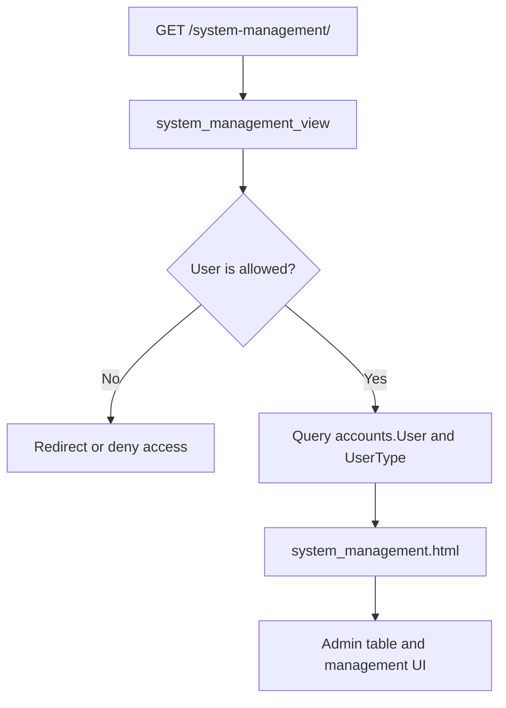

# System Management Page

Route: `/system-management/`

Sidebar label: `System Management`

Primary audience: platform administrators managing users, access roles, and
system-level governance.

## What This Page Does

The System Management page is the admin-only workspace for platform access
control. It is not a student analytics page; it exists to manage who can use the
platform.

For non-technical users, this page answers:

- Who has access to UniStudio?
- What role or user type does each person have?
- Which accounts are active?
- Who can administer the system?

For technical users, this page uses the custom `accounts.User` model and role
catalogue. Access is restricted to staff/admin users through view-level
authorization.

## Page Architecture

## Main Files

| Layer | Files |
| --- | --- |
| URL routes | `dashboard/urls.py` |
| View | `dashboard/views.py` |
| Template | `dashboard/templates/dashboard/system_management.html` |
| Auth models | `accounts/models.py` |
| Auth forms/views | `accounts/` |
| Tests | `dashboard/tests.py`, `accounts/tests.py` |

## Data Inputs

- `accounts.User` for user records.
- `accounts.UserType` for role catalogue.
- Django session and authentication middleware for access control.

## User Experience Notes

- Only authorized administrators should see this sidebar item.
- User role labels should be clear enough for non-technical administrators.
- Empty states should distinguish no users from lack of permission.

## Maintenance Checklist

- Keep sidebar visibility aligned with access rules.
- Run `python manage.py test accounts.tests dashboard.tests` after changing
  authentication or system-management access.
